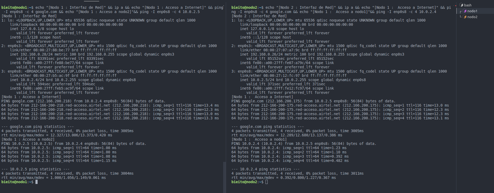

# BDA02-01

## Práctica 02. Creación de una red de 2 equipos

📽️ - [Configurar IP manual en Ubuntu 22.04 Server (Largo)](https://www.youtube.com/watch?v=zaxHdmqvq5s)

<!-- pagebreak -->

### Enunciado

El objetivo de esta práctica es simular una red de dos equipos configurados de manera que se puedan comunicar entre ellos de manera segura.

Crea en tu equipo dos máquinas virtuales con las siguientes características técnicas:

```txt
1 o 2 gigabytes de memoria RAM.
Un único usuario con tu mismo nombre en ambos equipos.
La contraseña del usuario será: abc123.
Los equipos se llamarán nodo1 y nodo2 respectivamente.
En VirtualBox configura la interfaz de red de cada equipo en modo de “red NAT”. El mismo nombre de red en ambos.
El resto de las características técnicas no son relevantes, puedes seleccionarlas a tu criterio.

```

creo maquina nodo1
clono la maquina y cambio el host name
En las maquinas voy a tener 2 adaptadores de red:

1. uno para red nat (red ia )
2. modo puente para conectarme desde el host mediante ssh
   ⚠️ Cuidado reiniciar la mac de la segunda maquina

```bash
sudo su
apt install network-manager
nmcli general hostname nodo2
reboot now
```

Conexion

```bash
#nodo1
  ssh -p 22 bieito@192.168.0.28
  # abc123.
#nodo2
  ssh -p 22 bieito@192.168.0.26
  # abc123.
```

levantamos la interfaz de red con el comando

```bash
# Lebantamos la segunda  interfaz  de red enp08s8
sudo ip link set enp0s8 up
# forzamos a que enlace un ip con
sudo dhclient enp0s8
```

<!-- pagebreak -->

### Situacion Inicial

```bash
# nodo1
echo "[Nodo 1 : Interfaz de Red]" && ip a && echo "[Nodo 1 : Acceso a Internet]" && ping -I enp0s8 -c 4 google.com && echo "[Nodo 1 : Acceso a nodo2]"&& ping -I enp0s8 -c 4 10.0.2.5
# nodo2
echo "[Nodo 2 : Interfaz de Red]" && ip a && echo "[Nodo 1 :  Acceso a Internet]" && ping -I enp0s8 -c 4 google.com && echo "[Nodo 1 :  Acceso a nodo1]"&& ping -I enp0s8 -c 4 10.0.2.4
```



Nodo1

- Interfaz enp0s3
  - conexion modo puente
  - ipv4 `192.168.0.28/24`
  - nota solo usaremos esta interfaz para la conexion ssh desde el host
- Intefaz enp0s8
  - conexion red nat en la red `10.0.2.0/24`
  - ipv4 `10.0.2.4`
  - nota usaremos `Ping -I enp0s8` para salir por la interfaz nateada

Nodo2

- Interfaz enp0s3
  - conexion modo puente
  - ipv4 `192.168.0.26/24`
  - nota solo usaremos esta interfaz para la conexion ssh desde el host
- Intefaz enp0s8
  - conexion red nat en la red `10.0.2.0/24`
  - ipv4 `10.0.2.5`
  - nota usaremos `Ping -I enp0s8` para salir por la interfaz nateada

<!-- pagebreak -->

### Resolución

1.- Averigua mediante comandos la IP, la máscara y la puerta de enlace de cada uno de los dos equipos de la red. Realiza una captura de pantalla de los comandos utilizados. Justifica con tus propias palabras los comandos que usas y explica sus salidas indicando de donde obtienes la información que se solicita en este apartado.

```bash

```

[img name](img path)

<!-- pagebreak -->

2.- Confirma con un ping que ambos equipos tienen comunicación con la puerta de enlace. Captura pantalla del comando y su salida en la que se pueda confirmar que hay comunicación. Explica con tus palabras el comando que usas y la interpretación del resultado de su ejecución.

```bash

```


<!-- pagebreak -->

3.- Confirma con un ping que ambos equipos tienen comunicación con una IP externa como por ejemplo la 8.8.8.8. Captura pantalla del comando y su salida en la que se pueda confirmar que hay comunicación. Explica con tus palabras el comando que usas y la interpretación del resultado de su ejecución.

```bash

```


<!-- pagebreak -->

4.- Confirma con un ping que ambos equipos tienen comunicación con una URL externa como por ejemplo la “www.google.es”. Captura pantalla del comando y su salida en la que se pueda confirmar que hay comunicación. Explica con tus palabras el comando que usas y la interpretación del resultado de su ejecución.

```bash

```


<!-- pagebreak -->

5.- Confirma con un ping que ambos equipos tienen comunicación entre ellos. Captura pantalla del comando y su salida en la que se pueda confirmar que hay comunicación. Explica con tus palabras el comando que usas y la interpretación del resultado de su ejecución.

```bash

```


<!-- pagebreak -->

6.- Confirma en los archivos de configuración del sistema operativo hosts y hostname que el nombre de ambos equipos es nodo1 y nodo2 respectivamente. Realiza una captura de pantalla donde se vea el contenido de ambos archivos en cada equipo. No es necesario justificar nada, con las capturas es suficiente.

```bash

```


<!-- pagebreak -->

7.- Modifica el archivo de configuración (/etc/netplan/…) en el nodo1 para que tenga una ip fija acabada en 101. El resto de los parámetros deben ser los adecuados para que siga funcionando sin problemas, solo queremos cambiar la ip asignada automáticamente por una fija de la misma subred. Realiza una captura de pantalla del contenido del archivo que modificas.

```bash

```


<!-- pagebreak -->

8.- Modifica el archivo de configuración (/etc/netplan/…) en el nodo2 para que tenga una ip fija acabada en 102. El resto de los parámetros deben ser los adecuados para que siga funcionando sin problemas, solo queremos cambiar la ip asignada automáticamente por una fija de la misma subred. Realiza una captura de pantalla del contenido del archivo que modificas.

```bash

```


<!-- pagebreak -->

9.- Confirma con un ping que, con esta nueva configuración, ambos equipos tienen comunicación con la puerta de enlace. Captura pantalla del comando y su salida en la que se pueda confirmar que hay comunicación. Explica con tus palabras el comando que usas y la interpretación del resultado de su ejecución.

```bash

```


<!-- pagebreak -->

10.- Confirma con un ping que, con esta nueva configuración, ambos equipos tienen comunicación con una IP externa como por ejemplo la 8.8.8.8. Captura pantalla del comando y su salida en la que se pueda confirmar que hay comunicación. Explica con tus palabras el comando que usas y la interpretación del resultado de su ejecución.

```bash

```


<!-- pagebreak -->

11.- Confirma con un ping que, con esta nueva configuración, ambos equipos tienen comunicación con una URL externa como por ejemplo la “www.google.es”. Captura pantalla del comando y su salida en la que se pueda confirmar que hay comunicación. Explica con tus palabras el comando que usas y la interpretación del resultado de su ejecución.

```bash

```


<!-- pagebreak -->

12.- Confirma con un ping que, con esta nueva configuración, ambos equipos tienen comunicación entre ellos usando sus nuevas IPs (por ejemplo ping X.X.X.102). Captura pantalla del comando y su salida en la que se pueda confirmar que hay comunicación. Explica con tus palabras el comando que usas y la interpretación del resultado de su ejecución.

```bash

```


<!-- pagebreak -->

13.- Confirma con un ping que, con esta nueva configuración, ambos equipos tienen comunicación entre ellos usando sus nombres (por ejemplo ping nodo2). Captura pantalla del comando y su salida en la que se pueda confirmar que hay comunicación. Explica con tus palabras el comando que usas y la interpretación del resultado de su ejecución.

```bash

```


<!-- pagebreak -->

14.- Realiza una conexión ssh al nodo2 usando ssh [tunombre]@nodo2 desde el nodo1. Nada más conectar cierra la conexión con un exit para volver al nodo1. Realiza una captura de pantalla de este proceso y explica qué comandos usas, que datos se solicitan y como sabes en qué equipo estás en cada momento.

```bash

```


<!-- pagebreak -->

15.- Crea una pareja de claves público-privada en cada equipo. Captura la pantalla del proceso de creación y de la ubicación de estas claves. No es necesaria explicación, con las capturas es suficiente.

```bash

```


<!-- pagebreak -->

16.- Copia e importa las llaves públicas de cada nodo en el otro. Captura de pantalla del proceso y confirmación de que se han importado correctamente. Explica con tus palabras los comandos utilizados y las rutas importantes.

```bash

```


<!-- pagebreak -->

17.- Realiza una conexión ssh al nodo1 usando ssh [tunombre]@nodo1 desde el nodo2, es decir usando nombre en lugar de ip. Nada más conectar cierra la conexión con un exit para volver al nodo2. Realiza una captura de pantalla de este proceso y explica qué comandos usas, que datos se solicitan y como sabes en qué equipo estás en cada momento.

```bash

```


<!-- pagebreak -->

18.- Explica con tus propias palabras para qué ha valido el intercambio de llaves públicas entre los nodos.
