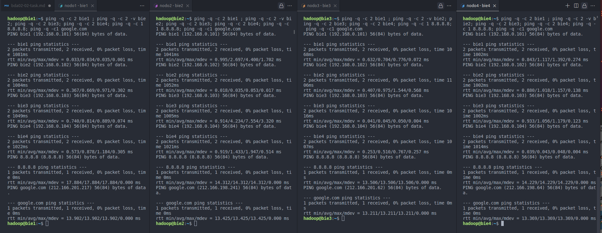
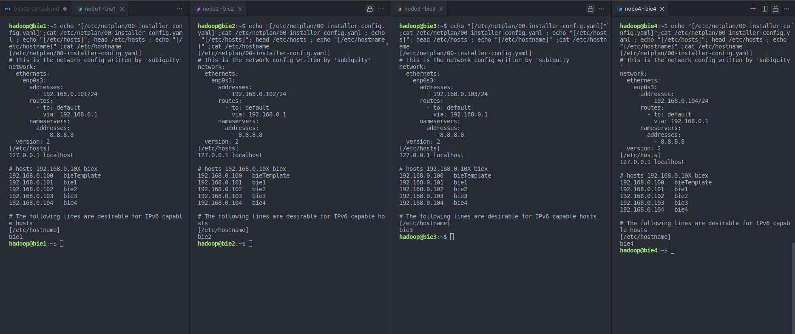
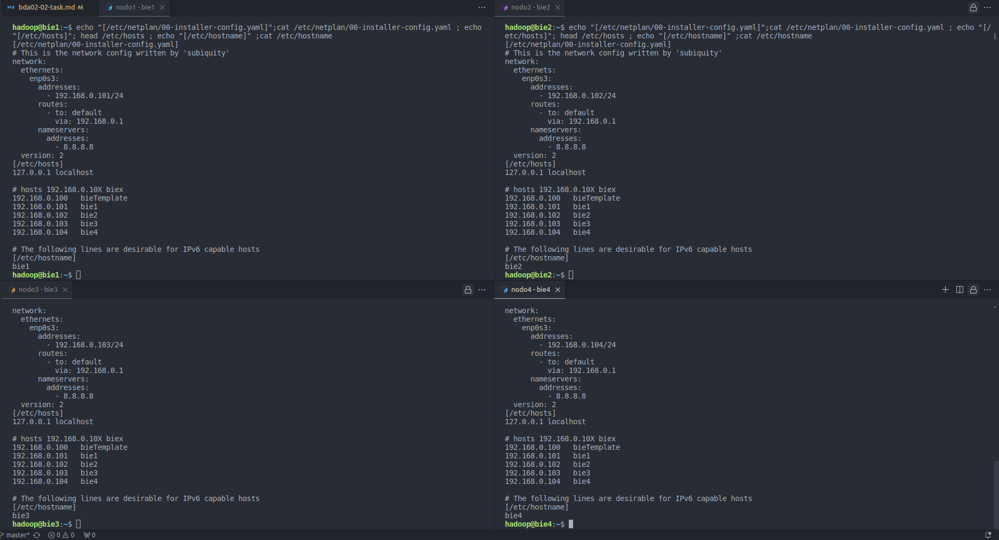
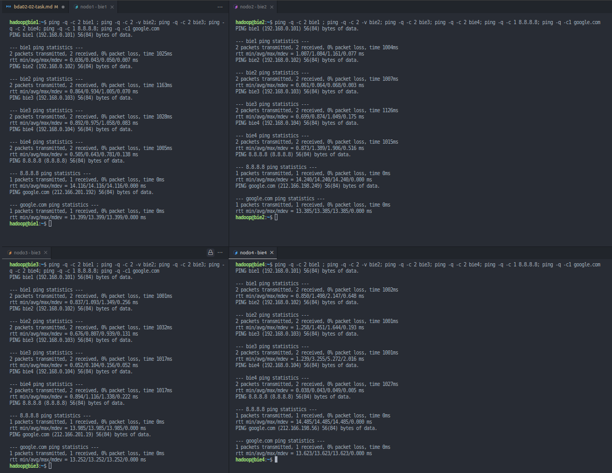
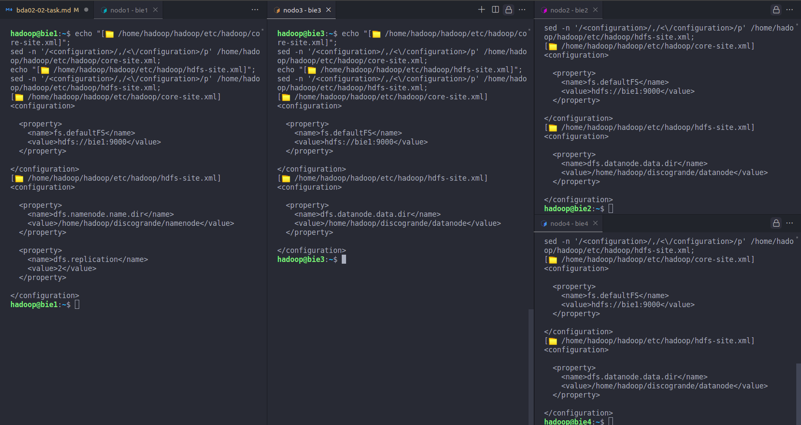
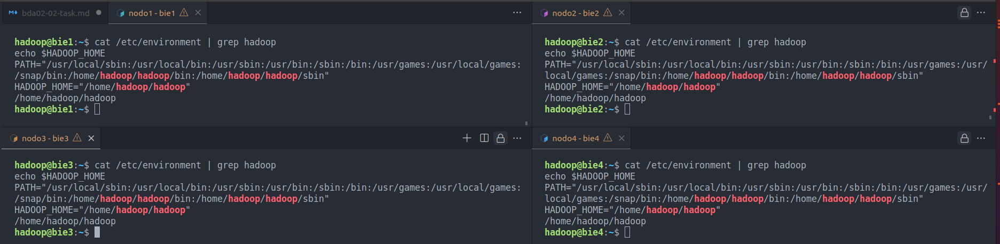

<!-- cSpell:ignore discogrande,curtin,descárgalo,descomprímelo, dfadmin,netplan,subiquity,hadoop,redhat,subtag,esbenp,ethernets,ecdsa,openssh,fdisk,namenode,datanode,decomisionado,hdfs,dfsadmin,reconfig,fsimage,datanodes,httpfs,jobhistory,namenodes,jconsole,getconf,Xceivers,pagebreak,Diffie-Hellman,
-->

# BDA02-02 PROCESOS

## 📹 VIDEOS

- [Puesta en marcha del clúster HDFS de Hadoop](https://youtu.be/cmGDpV30Daw?si=yAvtMDb-grAJe7F5)
- [Teoría de la capa HDFS en Hadoop 3.3.6](https://youtu.be/Swr5uuVaY3s?si=5b1iGCys41j0mtRL)
- [Preparación previa de los nodos sobre los que se montará un clúster HDFS](https://youtu.be/AEctvhZQRHQ?si=Zdov538_vNgymWPN)

## 📹 PDF

[Instalación HDFS](https://fpadistancia.edu.xunta.gal/pluginfile.php/1046408/mod_resource/content/2/20240129%20Instalacio%CC%81n%20HDFS.pdf)

<!-- pagebreak -->

### Preparación

Necesitaremos 4 equipos virtualizados con las siguientes características:
• Un disco de 50GB
• Un segundo disco de 100GB
• Un mínimo de 2 procesadores asignados.
• Sistema operativo: Ubuntu 22.04
• Usuario: hadoop
• Contraseña: BigData.,
• El disco de 100GB debe estar montado de manera permanente en la siguiente ruta “/home/hadoop/discogrande”
• Necesitaremos que algún nodo tenga interfaz gráfica para poder interactuar con HDFS a través de un navegador web.
• Cada equipo debe tener como nombre el tuyo más un número, por ejemplo, javi1, javi2, javi3 y javi4.
• Cada equipo podrá establecer una conexión ssh a cualquier otro usando su IP y por su nombre.
• Las conexiones ssh se autentificarán con llaves públicas de cada nodo.
• Todos los equipos tendrán salida a internet.
• Debes instalar en todos los nodos JAVA 8. (sudo apt install openjdk-8-jdk)
• Los nodos tendrán una IP fija manual que seguirá este patrón: IP acabada en 101 para el nodo1, IP acabada en 102 para el nodo2,…

<!-- pagebreak -->

### Preparación M.V

nota: clonado actualizar dirección mac.
template 080027AFC155
bie1 0800270FBB68
bie2 080027FA9391
bie3 08002707D310
bie4 08002717B72D

```bash
# cuidado al clonar las m.v. verificar que la mac es diferente
# template 080027AFC155
# bie1 0800270FBB68
# bie2 080027FA9391
# bie3 08002707D310
# bie4 08002717B72D
# usr --> hadoop
# psw --> BigData.,
# conexión shh host --> m.v.
ssh hadoop@192.168.0.101
ssh hadoop@192.168.0.102
ssh hadoop@192.168.0.103
ssh hadoop@192.168.0.104

ssh hadoop@bie1
ssh hadoop@bie2
ssh hadoop@bie3
ssh hadoop@bie4
```

<!-- pagebreak -->

### Comandos Usados

configurar ip

```bash
ip a # ver dirección ip y mascara
ip route #consultar tabla de rutas
sudo netplan try #
```

Verificar configuración de los archivos

```bash
echo "[/etc/netplan/00-installer-config.yaml]";
cat /etc/netplan/00-installer-config.yaml ;
echo "[/etc/hosts]"; head /etc/hosts ;
echo "[/etc/hostname]" ;cat /etc/hostname
```

verificar comunicación entre m.v.

```bash
ping -q -c 2 bie1 ;
ping -q -c 2 -v bie2;
ping -q -c 2 bie3;
ping -q -c 2 bie4;
ping -q -c 1 8.8.8.8;
ping -q -c1 google.com
```

<!-- pagebreak -->

## Puesta en marcha del clúster HDFS de Hadoop

### [📽️ Puesta en marcha del clúster HDFS de Hadoop](https://youtu.be/cmGDpV30Daw?si=yAvtMDb-grAJe7F5)

#### ✅ Task

- [x] configurar IPs fijas
      archivo
      **📄 /etc/netplan/00-installer-config.yaml**
      nota : varia 192.168.0.10X donde X es :
      bie1 --> 1
      bie2 --> 2
      bie3 --> 3
      bie4 --> 4
      --
      Ejemplo bie1

```bash
network:
  ethernets:
    enp0s3:
      addresses:
        - 192.168.0.101/24
      routes:
        - to: default
          via: 192.168.0.1
      nameservers:
        addresses:
          - 8.8.8.8
  version: 2
```

- [x] configurar nombres de equipos
      **📄 /etc/hostname**

`bie1`, `bie2`, `bie3`, `bie4`

- [x] configurar /etc/hosts
      **📄 /etc/hosts**

```bash
# hosts 192.168.0.10X bie{$x}
192.168.0.100   bieTemplate
192.168.0.101   bie1
192.168.0.102   bie2
192.168.0.103   bie3
192.168.0.104   bie4
```

<!-- -->
<!---->

<!-- pagebreak -->



<!-- pagebreak -->



<!-- pagebreak -->

- [x] configurar ssh server (min 8:38 --> 14:10)

- [x] configurar llaves públicas/privadas

```bash
# instalar ssh server
sudo apt install openssh-server
# crear pareja de llaves publica y privada
ssh-keygen
/home/hadoop/.shh/nodo2
# enter dejar contraseña en blanco
# enter dejar repetir contraseña en blanco
ls -la .ssh/ # verificar
# en un comando
ssh-keygen -t rsa -f /home/hadoop/.ssh/bie1 ; ls -la .ssh/
ssh-keygen -t rsa -f /home/hadoop/.ssh/bie2 ; ls -la .ssh/
ssh-keygen -t rsa -f /home/hadoop/.ssh/bie3 ; ls -la .ssh/
ssh-keygen -t rsa -f /home/hadoop/.ssh/bie4 ; ls -la .ssh/
```

<!-- pagebreak -->

📄 sudo cat /etc/ssh/ssh_config --> configuración Cliente

```bash
 sudo nano /etc/ssh/ssh_config
 IdentityFile ~/.ssh/nodo1 # escribir al final del archivo
 ## un solo comando
 sudo bash -c 'echo "IdentityFile ~/.ssh/bie1" >> /etc/ssh/ssh_config'
 sudo bash -c 'echo "IdentityFile ~/.ssh/bie2" >> /etc/ssh/ssh_config'
 sudo bash -c 'echo "IdentityFile ~/.ssh/bie3" >> /etc/ssh/ssh_config'
 sudo bash -c 'echo "IdentityFile ~/.ssh/bie4" >> /etc/ssh/ssh_config'
 ## verificar
 cat /etc/ssh/ssh_config | grep "IdentityFile"
```

📄 sudo cat /etc/ssh/ssh_config.d --> configuración Servidor

ssh --> claves publicas y privadas

```bash
#nodo1
ssh-copy-id -i /home/hadoop/.ssh/bie1.pub hadoop@bie1
# lo mismo con los demás
ssh-copy-id -i /home/hadoop/.ssh/bie1.pub hadoop@bie2
ssh-copy-id -i /home/hadoop/.ssh/bie1.pub hadoop@bie3
ssh-copy-id -i /home/hadoop/.ssh/bie1.pub hadoop@bie4
# un solo comando
for nodo in bie1 bie2 bie3 bie4;
do ssh-copy-id -i /home/hadoop/.ssh/bie1.pub hadoop@$nodo;
done
```

<!-- pagebreak -->

me confundí es bie1 en ved de nodo1
solucionamos el error

```bash
## == NODO1 - BIE1 ==
# primero borramos las claves
rm -rf /home/hadoop/.ssh/nodo1.pub ;
rm -rf /home/hadoop/.ssh/nodo1;ls -la .ssh/;
# creamos las nuevas
ssh-keygen -t rsa -f /home/hadoop/.ssh/bie1 ; ls -la .ssh/
# borramos y editamos el fichero `/etc/ssh/ssh_config`
sudo sed -i '/IdentityFile ~\/.ssh\/nodo1/d' /etc/ssh/ssh_config ;
sudo bash -c 'echo "IdentityFile ~/.ssh/bie1" >> /etc/ssh/ssh_config'
cat /etc/ssh/ssh_config | grep "IdentityFile"
# copiar la clave pública a los demás nodos
for nodo in bie1 bie2 bie3 bie4;
do ssh-copy-id -i /home/hadoop/.ssh/bie1.pub hadoop@$nodo;
done;

## == NODO1 - BIE2 ==
rm -rf /home/hadoop/.ssh/nodo2.pub ;
rm -rf /home/hadoop/.ssh/nodo2;ls -la .ssh/
ssh-keygen -t rsa -f /home/hadoop/.ssh/bie2 ; ls -la .ssh/
sudo sed -i '/IdentityFile ~\/.ssh\/nodo2/d' /etc/ssh/ssh_config ;
sudo bash -c 'echo "IdentityFile ~/.ssh/bie2" >> /etc/ssh/ssh_config';
cat /etc/ssh/ssh_config | grep "IdentityFile"
for nodo in bie1 bie2 bie3 bie4;
do ssh-copy-id -i /home/hadoop/.ssh/bie2.pub hadoop@$nodo;
done;

## == NODO1 - BIE3 ==
rm -rf /home/hadoop/.ssh/nodo3.pub ; rm -rf /home/hadoop/.ssh/nodo3;ls -la .ssh/
ssh-keygen -t rsa -f /home/hadoop/.ssh/bie3 ; ls -la .ssh/
sudo sed -i '/IdentityFile ~\/.ssh\/nodo2/d' /etc/ssh/ssh_config ;
sudo bash -c 'echo "IdentityFile ~/.ssh/bie3" >> /etc/ssh/ssh_config';
cat /etc/ssh/ssh_config | grep "IdentityFile";
for nodo in bie1 bie2 bie3 bie4;
do ssh-copy-id -i /home/hadoop/.ssh/bie3.pub hadoop@$nodo;
done;

## == NODO1 - BIE4 ==
rm -rf /home/hadoop/.ssh/nodo4.pub ; rm -rf /home/hadoop/.ssh/nodo4;ls -la .ssh/
ssh-keygen -t rsa -f /home/hadoop/.ssh/bie4 ; ls -la .ssh/
sudo sed -i '/IdentityFile ~\/.ssh\/nodo2/d' /etc/ssh/ssh_config ;
sudo bash -c 'echo "IdentityFile ~/.ssh/bie4" >> /etc/ssh/ssh_config';
cat /etc/ssh/ssh_config | grep "IdentityFile";
for nodo in bie1 bie2 bie3 bie4;
do ssh-copy-id -i /home/hadoop/.ssh/bie4.pub hadoop@$nodo;
done;
```

```bash
# verificaciones
echo "[ verificación creación clave publica y privada]";
ls -la .ssh/ | grep bie;
echo "[ verificación update file --> /etc/ssh/ssh_config]";
cat /etc/ssh/ssh_config | grep "bie";
echo "[ verificar el acceso por ssh a los demás nodos]";
for nodo in bie1 bie2 bie3 bie4;
do ssh -o "BatchMode=yes" hadoop@$nodo "echo 'Conexión exitosa a $nodo'";
done;
```

<!-- pagebreak -->

[nodos-ssh-config](img/nodos-ssh-config.png)

<!-- pagebreak -->

- [x] instalación JAVA 8 --> (min 14:10 - 17:00)

```bash
sudo apt install openjdk-8-jdk
# detectamos ruta de instalación --> /usr/lib/jvm/java-8-openjdk-amd64
# update-alternatives: utilizando [/usr/lib/jvm/java-8-openjdk-amd64]/bin/jconsole
```

📄 sudo nano /etc/environment

`sudo sh -c 'echo "JAVA_HOME=/usr/lib/jvm/java-8-openjdk-amd64" >> /etc/environment';`

```bash
cat /etc/environment | grep "JAVA_HOME";
# verificar instalación java
java -version
echo $JAVA_HOME;

```

[nodos-java](img/nodos-java.png)

- [x] configurar 2 disco de 100G en los nodos (min 17:00)

```bash
# --- Paso a paso --- #
lsblk
sudo fdisk /dev/sbd
p # imprimo la info del disco
g # cambio a gpt
n # creo una nueva partición
# intro
# intro
# intro
w # escribir los cambios
sudo mkfs.ext4 /dev/sbd1
# crear ruta de montaje
mkdir discogrande
# montar partición
sudo mount /dev/sbd1 /home/hadoop/discogrande/
# persistencia
 sudo nano /etc/fstab
# añadir --> /dev/sbd1    /home/hadoop/discogrande      ext4  defaults    0     0
# cambiar permisos a usuario hadoop
sudo chown -R hadoop:hadoop /home/hadoop/discogrande

# --- en un solo comando --- #
echo -e "g\nn\n\n\n\nw\n" | sudo fdisk /dev/sbd;
sudo mkfs.ext4 /dev/sbd1;
mkdir discogrande;
sudo mount /dev/sbd1 /home/hadoop/discogrande/;
sudo sh -c 'printf "/dev/sbd1\t/home/hadoop/discogrande\text4\tdefaults\t0\t0\n">> /etc/fstab';

sudo chown -R hadoop:hadoop /home/hadoop/discogrande;
# --- Verificar --- #
lsblk | grep "discogrande";
ls -la | grep "discogrande";
```

<!-- pagebreak -->

[nodos-discos](img/nodos-discos.png)

<!-- pagebreak -->

- [x] instalar hadoop

```bash
# instalar hadoop
wget https://dlcdn.apache.org/hadoop/common/hadoop-3.3.6/hadoop-3.3.6.tar.gz
## descomprimir
tar -xzf hadoop-3.3.6.tar.gz
ls -la
## acortar nombre y ruta
mv hadoop-3.3.6 hadoop
# copiar carpeta hadoop a los otros nodos
scp -r /home/hadoop/hadoop hadoop@bie2:/home/hadoop

```

📄 sudo nano /etc/environment

```bash
# añadir al PATH
sudo nano /etc/environment
PATH="[...]:/home/hadoop/hadoop/bin:/home/hadoop/hadoop/sbin"
HADOOP_HOME="/home/hadoop/hadoop"
# psw --> BigData.,
# verificar
cat /etc/environment | grep hadoop
echo $HADOOP_HOME
# creo namenode en nodo1
mkdir ~/discogrande/namenode
# creo en nodo2,3,4 datanode
mkdir ~/discogrande/datanode

```

📄 `nano /home/hadoop/hadoop/etc/hadoop/core-site.xml`
[valores --> core-default.xml](https://hadoop.apache.org/docs/r2.8.0/hadoop-project-dist/hadoop-common/core-default.xml)
nodo 1,2,3,4
**_📄 core-site.xml_**

> Este archivo se utiliza para especificar la configuración centralizada para el sistema de archivos y otros aspectos fundamentales del clúster de Hadoop

> En este caso definimos que el nodo bie1 actuara como namenode esta configuración se aplica en todos los nodos, puesto que es una configuración global y todos ellos tienen que saber la dirección del nodo que actuara como namenode, es decir donde se guardaran la tabla direcciones.

**_Propiedad_**
`fs.defaultFS` Propiedad que define el sistema de archivos por defecto que utilizará Hadoop
**_Value_**
`hdfs://bie1:9000`

- `hdfs` Sistema de archivos por defecto utilizado por Hadoop será HDFS (Hadoop Distributed File System)
- `bie1` la dirección del namenode
- `:9000` puerto 9000.

```xml
<configuration>
<!--
  `fs.defaultFS`
    propiedad que define el sistema de archivos por defecto que utilizará Hadoop , indicamos la dirección del namenode a la que debe conectarse Hadoop
   hdfs://bie1:9000=
  `hdfs`   sistema de archivos por defecto utilizado por Hadoop será HDFS (Hadoop Distributed File System)
  `bie1` la dirección del namenode
  `:9000`  puerto 9000.
-->
  <property>
    <name>fs.defaultFS</name>
    <value>hdfs://bie1:9000</value>
  </property>

</configuration>
```

```bash
scp /home/hadoop/hadoop/etc/hadoop/core-site.xml hadoop@bie2:/home/hadoop/hadoop/etc/hadoop/core-site.xml
scp /home/hadoop/hadoop/etc/hadoop/core-site.xml hadoop@bie3:/home/hadoop/hadoop/etc/hadoop/core-site.xml
scp /home/hadoop/hadoop/etc/hadoop/core-site.xml hadoop@bie4:/home/hadoop/hadoop/etc/hadoop/core-site.xml
```

📄 `nano /home/hadoop/hadoop/etc/hadoop/hdfs-site.xml`
nodo1

```xml
<configuration>

  <property>
    <name>dfs.namenode.name.dir</name>
    <value>/home/hadoop/discogrande/namenode</value>
  </property>

  <property>
    <name>dfs.replication</name>
    <value>2</value>
  </property>

</configuration>

```

nodo2,3,4

```xml
<configuration>

  <property>
    <name>dfs.datanode.data.dir</name>
    <value>/home/hadoop/discogrande/datanode</value>
  </property>

</configuration>
```

```bash
scp /home/hadoop/hadoop/etc/hadoop/hdfs-site.xml hadoop@bie3:/home/hadoop/hadoop/etc/hadoop/hdfs-site.xml
scp /home/hadoop/hadoop/etc/hadoop/hdfs-site.xml hadoop@bie4:/home/hadoop/hadoop/etc/hadoop/hdfs-site.xml
```

verificar

```bash
echo "[📄 /home/hadoop/hadoop/etc/hadoop/core-site.xml]";
sed -n '/<configuration>/,/<\/configuration>/p' /home/hadoop/hadoop/etc/hadoop/core-site.xml;
echo "[📄 /home/hadoop/hadoop/etc/hadoop/hdfs-site.xml]";
sed -n '/<configuration>/,/<\/configuration>/p' /home/hadoop/hadoop/etc/hadoop/hdfs-site.xml;
```



<!-- pagebreak -->



<!-- pagebreak -->

formatear namenode

```bash
hdfs namenode -form
```

volver a leer la configuración de en caliente

```bash
hdfs dfsadmin -reconfig namenode bie1:9000 start
```

lanzar
nodo1

```bash
hdfs --daemon start namenode
```

nodo2 , nodo3 , nodo4

```bash
hdfs --daemon start datanode
```

ver configuración

[web - http://192.168.0.101:9870/](http://192.168.0.101:9870/)

```bash
 jps # procesos java activos
 hdfs dfsadmin -report
```

- [x] configuración fina hadoop

## resumen de la practica

nodo1

📄 `nano /home/hadoop/hadoop/etc/hadoop/hdfs-site.xml`

```xml

<!--
  more configuration property
  https://hadoop.apache.org/docs/r2.7.0/hadoop-project-dist/hadoop-hdfs/hdfs-default.xml

  nota:
  al modificar este archivo se puede configurar en caliente
  hdfs dfsadmin -reconfig namenode bie1:9000 start
-->
<configuration>
<!--
  dfs.namenode.name.dir
  file://${hadoop.tmp.dir}/dfs/name
  Determines where on the local filesystem the DFS name node should store the name table(fsimage). If this is a comma-delimited list of directories then the name table is replicated in all of the directories, for redundancy.
  - - - - - - - - - - - - - - - - - - - - - - - -
  Ruta donde esta guarda la table de direcciones de namenode
-->
  <property>
    <name>dfs.namenode.name.dir</name>
    <value>/home/hadoop/discogrande/namenode</value>
  </property>
<!--
  dfs.replication
  default 3
  Default block replication. The actual number of replications can be specified when the file is created. The default is used if replication is not specified in create time.
  - - - - - - - - - - - - - - - - - - - - - - - -
  la información se divide en
-->
  <property>
    <name>dfs.replication</name>
    <value>2</value>
  </property>
<!--
  dfs.heartbeat.interval
  default 3
  Determines datanode heartbeat interval in seconds.
  - - - - - - - - - -
  tiempo que tarde en mili-segundos en dar un latido
-->
  <property>
    <name>dfs.heartbeat.interval</name>
    <value>1</value>
  </property>
<!--
  dfs.namenode.heartbeat.recheck-interval
  default 	300000
  300000	This time decides the interval to check for expired datanodes. With this value and dfs.heartbeat.interval, the interval of deciding the datanode is stale or not is also calculated. The unit of this configuration is millisecond.
  - - - - - - - - - - - - - - - - - - - - - - - -
  En el proceso de declarar un nodo como muerto
  tras no responder un nodo tras 10 latidos
  hadoop establece w periodos de gracia
  tiempo en mili-segundos de cada periodo de gracia :
-->
  <property>
    <name>dfs.namenode.heartbeat.recheck-interval</name>
    <value>500</value>
  </property>
<!--
  dfs.hosts
  Names a file that contains a list of hosts that are permitted to connect to the namenode. The full pathname of the file must be specified. If the value is empty, all hosts are permitted.
  - - - - - - - - - - - - - - - - - - - - - - - -
  En el proceso de declarar un nodo como muerto
  tras no responder un nodo tras 10 latidos
  hadoop establece w periodos de gracia
  tiempo en mili-segundos de cada periodo de gracia :
-->
   <property>
    <name>dfs.hosts</name>
    <value>/home/hadoop/hadoop/etc/hadoop/workers</value>
  </property>

</configuration>
```
