<!-- 
extensiones vsc spell and markdown
- Spanish - Code Spell Checker 
- Code Spell Checker
- markdownlint
- Markdown Preview Enhanced

-->
<!-- cSpell:ignore discogrande,curtin,descárgalo,descomprímelo, dfadmin,netplan,subiquity,hadoop,redhat,subtag,esbenp,ethernets,ecdsa,openssh,fdisk,namenode,datanode,decomisionado,hdfs,dfsadmin,reconfig,fsimage,datanodes,httpfs,jobhistory,namenodes,jconsole,getconf,Xceivers,pagebreak,Diffie-Hellman,supergroup
-->
# BDA02-02

## Practica Creación de un clúster HDFS

DNI: 39465322J
Alumno : Bieito Sousa Barreiro

Url Entrega : [Creación de un clúster HDFS](https://fpadistancia.edu.xunta.gal/mod/assign/view.php?id=817154)

### Objetivo

• Demostrar capacidad para crear una red de equipos interconectados.

<!-- pagebreak -->

### Enunciado

1.- Realiza una conexión ssh de tu nodo1 a tu nodo4 usando el nombre del nodo y sin necesidad de introducir contraseña.</br>Captura pantalla donde se vea que usas el nombre del nodo en lugar de su IP y que no has tenido que introducir contraseña.
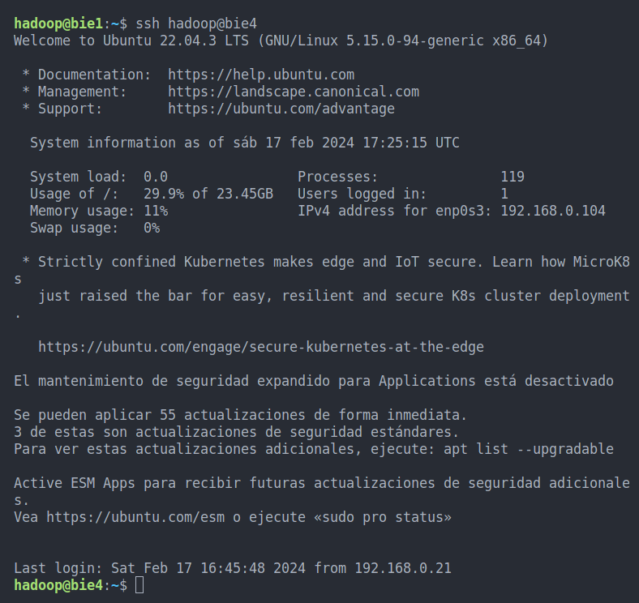

<!-- pagebreak -->

2.- Comprueba en la web [https://hadoop.apache.org/releases](https://hadoop.apache.org/releases) la ruta del paquete hadoop-3.3.6 para tu plataforma, descárgalo con wget y descomprímelo de manera que su contenido quede en la ruta `/home/hadoop/hadoop`.</br>Repite esta operación en todos los nodos. Realiza una captura de pantalla del comando`ls -la /home/hadoop/hadoop`.

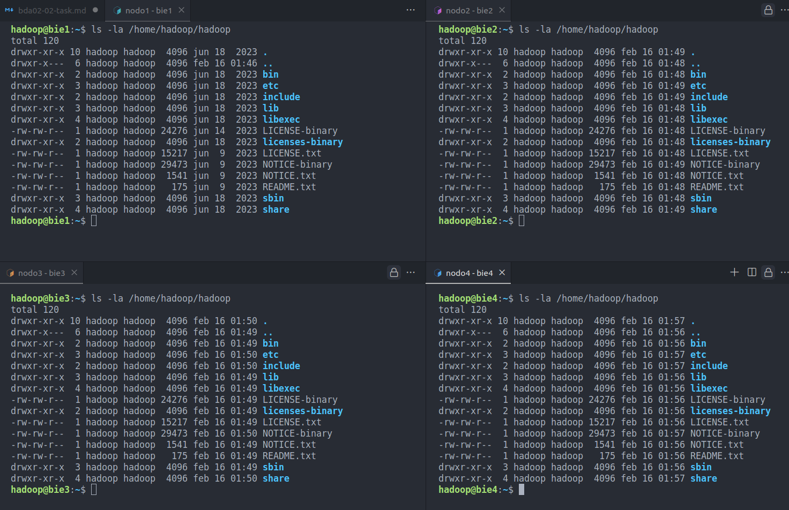

<!-- pagebreak -->

3.- Edita el archivo “/etc/environment” para añadir lo siguiente:• Una línea con: `JAVA_HOME:”/usr/lib/jvm/java-8-openjdk-amd64”`
• Una línea con: `HADOOP_HOME:”/home/hadoop/hadoop”`
• Añadir al final del `PATH` las rutas de `bin y sbin` de hadoop (ojo con los dos puntos y las comillas):`/home/hadoop/hadoop/bin:/home/hadoop/hadoop/sbin`</br>Realiza una captura del comando `cat /etc/environment`. Explica con tus palabras para que sirve lo que acabas de hacer en este archivo.

>El archivo `/etc/environment`

1. archivo de configuración
2. se utiliza para establecer **_variables de entorno globales_** para **_todos los usuarios del sistema_**.
3. **_variables de entorno_** se aplican a **_todos los procesos y programas_** que se ejecutan en el sistema.

>Necesitamos definir un entorno en el cual Hadoop pueda ejecutar acciones en cualquiera de los nodos o en varios de los mismos de manera simultanea, sin preocuparnos de la configuración individual de cada nodo.

>Para ello tenemos que definir un entorno de manera global y satisfacer en el las necesidades de hadoop en este caso seria el acceso a la ejecución de binarios y archivos de configuración tanto de java como del propio hadoop para ello definimos en `/etc/environment`dos variables

- `HADOOP_HOME`con la carpeta raíz de hadoop la cual contiene archivos de configuración y ejecutables de hadoop
- `JAVA_HOME`con la carpeta raíz de hadoop la cual contiene archivos de configuración y ejecutables de java.

>a su vez es necesario definir en `$PATH` la ruta de los binarios tanto de java como de hadoop

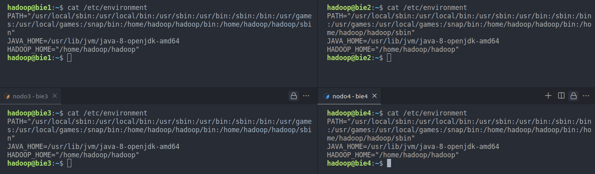

<!-- pagebreak -->

4.- Modifica la configuración del archivo `home/hadoop/hadoop/etc/hadoop/core-site.xml` para indicar que la propiedad `fs.defaultFS` tiene un valor de `hdfs://nodo1:9000`. Donde nodo1 será uno de tus nodos que has elegido para la función de NameNode. Haz lo mismo en todos los nodos.</br>Realiza la captura de pantalla del comando `cat /home/hadoop/hadoop/etc/core-site.xml` en cualquiera de los nodos.

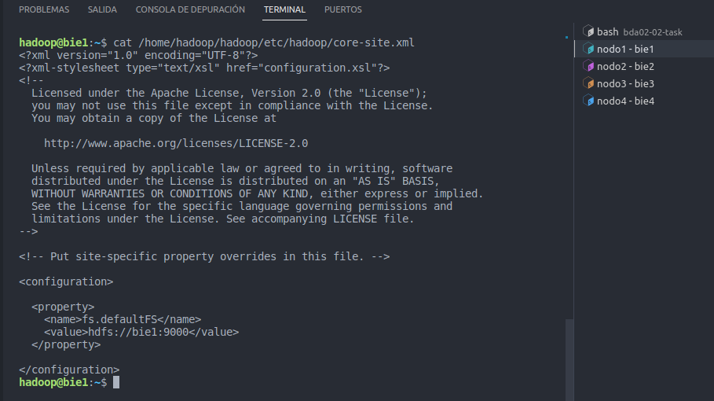

¿Qué estamos indicando en esa configuración?

> Este archivo `📄 core-site.xml` se utiliza para especificar la configuración centralizada para el sistema de archivos y otros aspectos fundamentales del clúster de Hadoop

|type|Concepto| descripción |
|-|-|-|
|Propiedad|`fs.defaultFS`|Propiedad que define el sistema de archivos por defecto que utilizará Hadoop|
|value|`hdfs://bie1:9000`|`hdfs` Sistema de archivos por defecto utilizado por Hadoop será HDFS (Hadoop Distributed File System) </br>`bie1` la dirección del namenode </br>`:9000` puerto 9000.|

<!-- pagebreak -->

¿Por qué todos los nodos comparten la la misma configuración en el archivo core-site.xml?
> En este caso definimos que el nodo bie1 actuara como namenode esta configuración se aplica en todos los nodos, puesto que es una configuración global y todos ellos tienen que saber la dirección del nodo que actuara como namenode, es decir donde se guardaran la tabla direcciones.

```xml
<configuration>
<!--
  `fs.defaultFS`
    propiedad que define el sistema de archivos por defecto que utilizará Hadoop , indicamos la dirección del namenode a la que debe conectarse Hadoop
   hdfs://bie1:9000=
  `hdfs`   sistema de archivos por defecto utilizado por Hadoop será HDFS (Hadoop Distributed File System)
  `bie1` la dirección del namenode
  `:9000`  puerto 9000.
-->
  <property>
    <name>fs.defaultFS</name>
    <value>hdfs://bie1:9000</value>
  </property>

</configuration>
```

<!-- pagebreak -->

5.- En el nodo que realizará las funciones de NameNode modifica el archivo
`/home/hadoop/hadoop/etc/hadoop/hdfs-site.xml` para incluir las siguientes propiedades:
• Nombre: `dfs.namenode.name.dir` con valor `/home/hadoop/discogrande/namenode`
• Nombre: `dfs.replication` con valor `2`
Realiza una captura de pantalla del comando `cat /home/hadoop/hadoop/etc/hadoop/hdfs-site.xml`.

¿Qué indicamos con la primera propiedad?

> `dfs.namenode.name.dir` Ruta donde esta guarda la tabla de direcciones de namenode

¿Qué indicamos con la segunda propiedad?

> `dfs.replication`: Cuando guardas un archivo en Hadoop, el archivo se divide en fragmentos de datos llamados "bloques" , pore defecto (128 MB). estos bloques se guardan en n nodos siendo n el valor de dfs.replication, en este caso como el valor es 2 se guarda cada "bloque" en 2 nodos.

¿Por qué no replicamos el contenido de este archivo en el resto de los nodos?

> en este archivo el nodo1 actúa como namenode, por lo cual unicamente definimos en el la configuración relativa al proceso de namenode, mientras que nodo2,3,4 van a actuará como datanode y definimos en ello de manera idéntica la configuración relativa a datanode

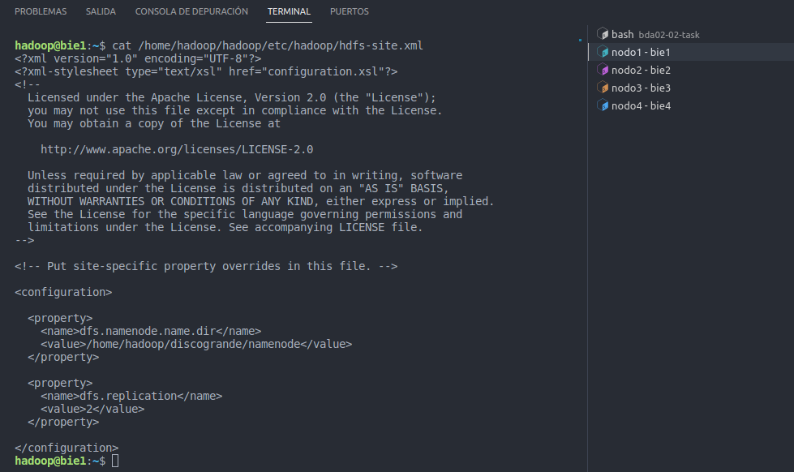

<!-- pagebreak -->

📄 `/home/hadoop/hadoop/etc/hadoop/hdfs-site.xml` en `namenode`

```xml
<!--
  more configuration property
  https://hadoop.apache.org/docs/r2.7.0/hadoop-project-dist/hadoop-hdfs/hdfs-default.xml

  nota:
  al modificar este archivo se puede configurar en caliente
  hdfs dfsadmin -reconfig namenode bie1:9000 start
-->
<configuration>
<!--
  dfs.namenode.name.dir
  file://${hadoop.tmp.dir}/dfs/name
  Determines where on the local filesystem the DFS name node should store the name table(fsimage). If this is a comma-delimited list of directories then the name table is replicated in all of the directories, for redundancy.
  - - - - - - - - - - - - - - - - - - - - - - - -
  Ruta donde esta guarda la table de direcciones de namenode
-->
  <property>
    <name>dfs.namenode.name.dir</name>
    <value>/home/hadoop/discogrande/namenode</value>
  </property>
<!--
  dfs.replication
  default 3
  Default block replication. The actual number of replications can be specified when the file is created. The default is used if replication is not specified in create time.
  - - - - - - - - - - - - - - - - - - - - - - - -
  Cuando guardas un archivo en Hadoop, el archivo se divide en fragmentos de datos llamados "bloques" , pore defecto (128 MB). estos bloques se guardan en n nodos siendo n el valor de dfs.replication, en este caso como el valor es 2 se guarda cada "bloque" en 2 nodos.
-->
  <property>
    <name>dfs.replication</name>
    <value>2</value>
  </property>

</configuration>
```
<!-- pagebreak -->

6.- En cada uno de los nodos que realizarán las funciones de DataNode modifica el archivo `/home/hadoop/hadoop/etc/hadoop/hdfs-site.xml` para que incluya la propiedad de `dfs.datanode.data.dir` con el valor `/home/hadoop/discogrande/datanode`.</br>Captura la pantalla del comando `cat /home/hadoop/hadoop/etc/hadoop/hdfs-site`

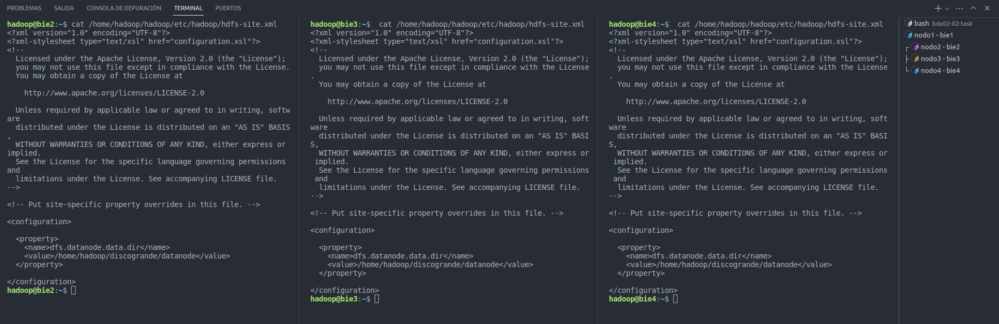

Explica con tus palabras la posible razón por la que el mismo archivo “hdfs-site.xml” es distinto en NameNodes y en DataNodes.

> En esta practica por optimización decidimos definir que en nodo1 se establece la configuración de la tabla de namenode, por lo tanto se encapsula la configuración de todo lo relacionado con namenode en nodo1, asimismo decidimos que nodo2,3,4 actuaran como datanode.

Justifica con tus palabras si consideras que sería bueno (o no) fusionar ambas versiones de “hdfs-site.xml” en una sola en la que aparezcan todas las propiedades.

> si tenemos los recursos disponibles para poder aislar un nodo para que su función sea exclusiva de namenode seria lo optimo, teniendo en cuenta que en este nodo se define la tabla de direcciones que determina en que nodo y en que espacio de memoria esta guardaos los datos, y que hadoop para ejecutar sus acciones con relación a los datos el único nodo imprescindible es el que contenga namenode, si me parece una buena practica incluso tener un nodo cuya función exclusiva sea actuar de back-up del nodo namenode por si este cae no estaría mal.

<!-- pagebreak -->

7.- Formatea el sistema de ficheros HDFS en el NameNode.</br>Captura la pantalla del comando que has usado y su salida. Indica qué comando has usado. Indica desde qué nodo has ejecutado el comando.

```bash
hdfs namenode -form
```

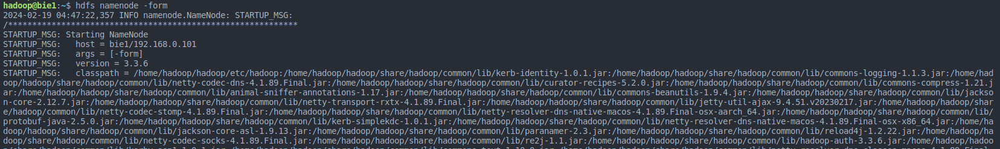

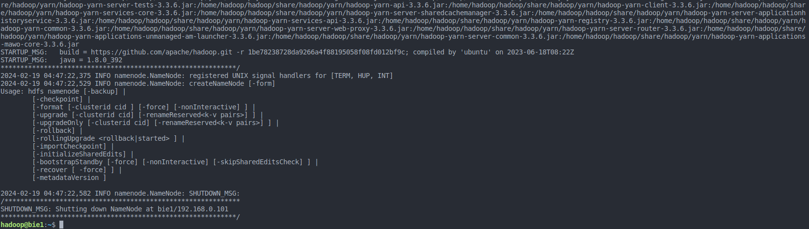

En este momento en el que aún no hay ningún namenode ni datanode encendido, ¿qué dirías que está haciendo este formateo?

> El formateo prepara el directorio con un sistema de archivos tipo HDFS que esta optimizado con una estructura para el uso de hadoop, con lo cual es necesario realizarlo antes de levantar el namenode dado que tiene que leer y escribir en el mismo.

<!-- pagebreak -->

8.- Arranca únicamente el namenode desde su nodo. Captura pantalla en la que se vea el comando que usas y su salida.

nota la `primera vez` que lo ejecute :

- error : no se había formateado correctamente namenode
- warning : se creo el archivo de logs

```bash
hdfs --daemon start namenode
```

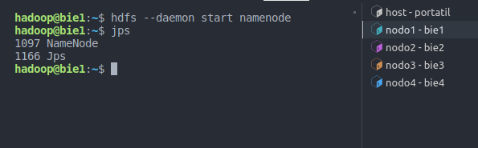

<!-- pagebreak -->

9.- Desde el namenode realiza una captura de pantalla de la salida del comando `hdfs dfsadmin -report`.</br>Interpreta y explica lo que puedas de la salida del comando.

```bash
hdfs dfsadmin -report
```

```bash
hadoop@bie1:~$ hdfs dfsadmin -report
Configured Capacity: 0 (0 B)
Present Capacity: 0 (0 B)
DFS Remaining: 0 (0 B)
DFS Used: 0 (0 B)
DFS Used%: 0.00%
Replicated Blocks:
        Under replicated blocks: 0
        Blocks with corrupt replicas: 0
        Missing blocks: 0
        Missing blocks (with replication factor 1): 0
        Low redundancy blocks with highest priority to recover: 0
        Pending deletion blocks: 0
Erasure Coded Block Groups: 
        Low redundancy block groups: 0
        Block groups with corrupt internal blocks: 0
        Missing block groups: 0
        Low redundancy blocks with highest priority to recover: 0
        Pending deletion blocks: 0

-------------------------------------------------
```

> En este caso la salida tenemos todos los valores a `0` puesto que al no tener levantado ningún datanode no disponemos de espacio ni capacidad

|concepto|descripción|
|-|-|
|`Configured Capacity`| Capacidad total configurada del sistema de archivos en el clúster HDFS.|
|`Present Capacity`| Capacidad actual del sistema de archivos en el clúster HDFS.|
|`DFS Remaining`| Espacio restante disponible en el sistema de archivos distribuido HDFS.|
|`DFS Used`| Espacio utilizado en el sistema de archivos distribuido HDFS.|
|`DFS Used%`| Porcentaje del espacio utilizado en el sistema de archivos distribuido HDFS.|
|`Replicated Blocks`| Información sobre los bloques replicados en el sistema de archivos distribuido HDFS, incluyendo la cantidad de bloques que están bajo replicados, los bloques con réplicas corruptas, los bloques que faltan, etc.|
|`Erasure Coded Block Groups`| Información sobre grupos de bloques codificados por borrado en el sistema de archivos distribuido HDFS, incluyendo la cantidad de grupos de bloques con baja redundancia, los grupos de bloques con bloques internos corruptos, los grupos de bloques que faltan, etc.|

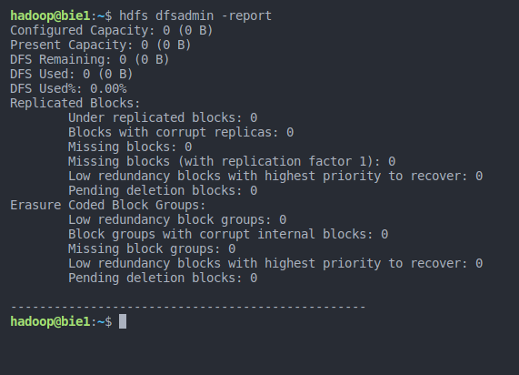

<!-- pagebreak -->

10.- Arranca los datanodes de uno en uno desde cada nodo.</br>Captura pantalla en la que se vea el comando que usas y su salida en alguno de los nodos.

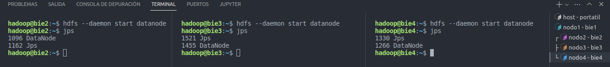

<!-- pagebreak -->

11.- Desde el namenode realiza una captura de pantalla de la salida del comando `hdfs dfsadmin -report`.</br>Si tienes una interfaz gráfica también puedes capturar a web en la ip del `namenode:9870`, `apartado datanodes`.</br> Interpreta y explica lo que puedas de la salida del comando.

```bash
hdfs --daemon start datanode
hdfs dfsadmin -report
```

> Nos sale primero la información del `nameNode`: </br> Capacidad total configurada del sistema de archivos (293.61 GB) </br> Capacidad actual del sistema de archivos (278.57 GB) </br> Espacio restante disponible en el sistema de archivos (278.57 GB) </br> Espacio utilizado 73728 (72 KB) </br> Porcentaje del espacio utilizado en el sistema de archivos (0.00%)

> (293.61 GB)  es la suma de la capacidad de los 3 datanode (3\*97.87 GB) </br> (278.57 GB) es la suma del espacio restante disponible de los 3 datanode (3\*92.86 GB)

> nos sale que tenemos activos 3 datanode

> de cada `datanode`  , ip el nombre y el puerto :9866 en cada nodo , numero de bloques

```bash

Configured Capacity: 315264577536 (293.61 GB)
Present Capacity: 299108155392 (278.57 GB)
DFS Remaining: 299108081664 (278.57 GB)
DFS Used: 73728 (72 KB)
DFS Used%: 0.00%
Replicated Blocks:
        Under replicated blocks: 0
        Blocks with corrupt replicas: 0
        Missing blocks: 0
        Missing blocks (with replication factor 1): 0
        Low redundancy blocks with highest priority to recover: 0
        Pending deletion blocks: 0
Erasure Coded Block Groups:
        Low redundancy block groups: 0
        Block groups with corrupt internal blocks: 0
        Missing block groups: 0
        Low redundancy blocks with highest priority to recover: 0
        Pending deletion blocks: 0

-------------------------------------------------
Live datanodes (3):

Name: 192.168.0.102:9866 (bie2)
Hostname: bie2
Decommission Status : Normal
Configured Capacity: 105088192512 (97.87 GB)
DFS Used: 24576 (24 KB)
Non DFS Used: 45056 (44 KB)
DFS Remaining: 99702693888 (92.86 GB)
DFS Used%: 0.00%
DFS Remaining%: 94.88%
Configured Cache Capacity: 0 (0 B)
Cache Used: 0 (0 B)
Cache Remaining: 0 (0 B)
Cache Used%: 100.00%
Cache Remaining%: 0.00%
Xceivers: 0
Last contact: Sat Feb 17 20:22:26 UTC 2024
Last Block Report: Sat Feb 17 20:19:59 UTC 2024
Num of Blocks: 0


Name: 192.168.0.103:9866 (bie3)
Hostname: bie3
Decommission Status : Normal
Configured Capacity: 105088192512 (97.87 GB)
DFS Used: 24576 (24 KB)
Non DFS Used: 45056 (44 KB)
DFS Remaining: 99702693888 (92.86 GB)
DFS Used%: 0.00%
DFS Remaining%: 94.88%
Configured Cache Capacity: 0 (0 B)
Cache Used: 0 (0 B)
Cache Remaining: 0 (0 B)
Cache Used%: 100.00%
Cache Remaining%: 0.00%
Xceivers: 0
Last contact: Sat Feb 17 20:22:25 UTC 2024
Last Block Report: Sat Feb 17 20:19:34 UTC 2024
Num of Blocks: 0


Name: 192.168.0.104:9866 (bie4)
Hostname: bie4
Decommission Status : Normal
Configured Capacity: 105088192512 (97.87 GB)
DFS Used: 24576 (24 KB)
Non DFS Used: 45056 (44 KB)
DFS Remaining: 99702693888 (92.86 GB)
DFS Used%: 0.00%
DFS Remaining%: 94.88%
Configured Cache Capacity: 0 (0 B)
Cache Used: 0 (0 B)
Cache Remaining: 0 (0 B)
Cache Used%: 100.00%
Cache Remaining%: 0.00%
Xceivers: 0
Last contact: Sat Feb 17 20:22:25 UTC 2024
Last Block Report: Sat Feb 17 20:20:10 UTC 2024
Num of Blocks: 0

```
<!-- pagebreak -->

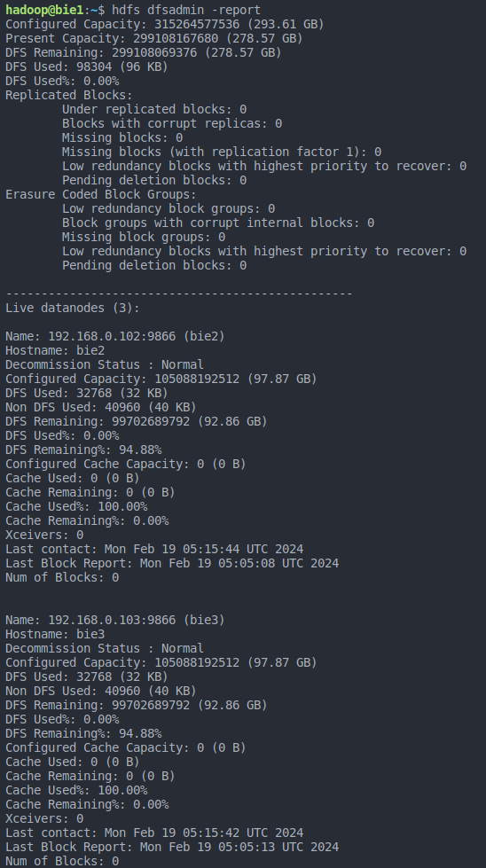

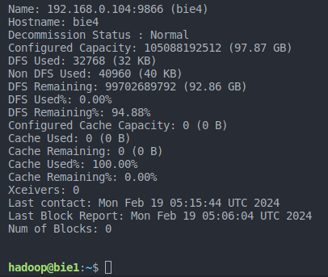

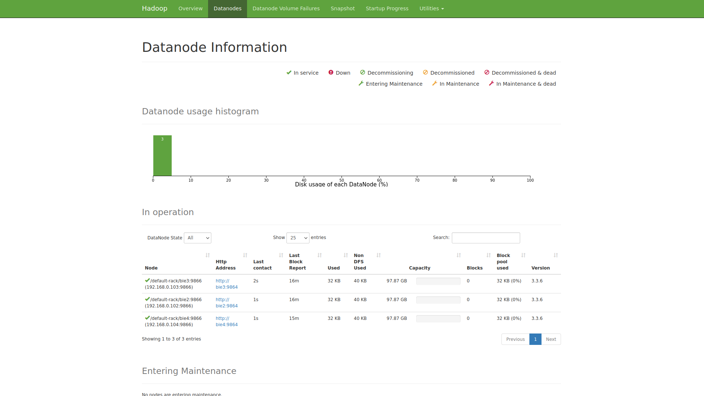

<!-- pagebreak -->

12.- Realiza una captura de la salida del comando `hdfs dfs -df -h` ejecutado en cualquiera de los nodos.</br>Interpreta con tus palabras el resultado.

```bash
hdfs dfs -df -h
```

```bash
hadoop@bie1:~$ hdfs dfs -df -h
Filesystem           Size  Used  Available  Use%
hdfs://bie1:9000  293.6 G  96 K    278.6 G    0%
```

> `Filesystem : hdfs://bie1:9000` que es la dirección del namenode
> `Size: 293.6 G` tamaño total
> `Used: 96 K` espacio utilizado
> `Available: 278.6 G`espacio disponible
> `Use%: 0%` porcentaje de espacio utilizado

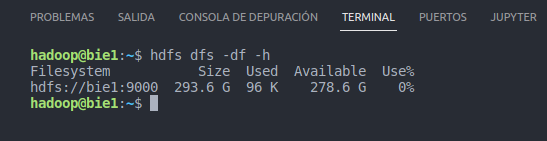

<!-- pagebreak -->

13.- Apaga un datanode y confirma que se muestra como caído.</br>Realiza una captura de pantalla de la salida del comando donde se pueda ver esta información.

tiramos el nodo4

```bash
hadoop@bie4:~$ hdfs --daemon stop datanode
```

tras 10 min aparece - Dead datanodes (1) - Live datanodes (2)

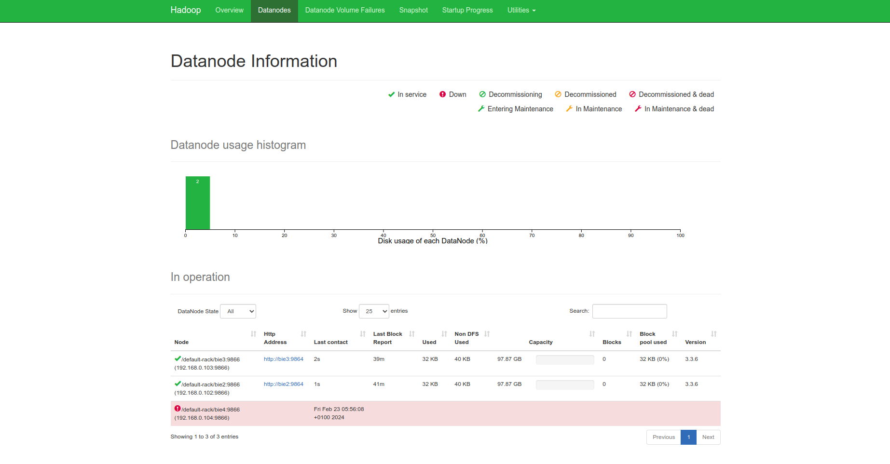

```bash
hadoop@bie4:~$ hdfs --daemon stop datanode
hadoop@bie4:~$ hdfs dfsadmin -report
Configured Capacity: 210176385024 (195.74 GB)
Present Capacity: 199405445120 (185.71 GB)
DFS Remaining: 199405379584 (185.71 GB)
DFS Used: 65536 (64 KB)
DFS Used%: 0.00%
Replicated Blocks:
        Under replicated blocks: 0
        Blocks with corrupt replicas: 0
        Missing blocks: 0
        Missing blocks (with replication factor 1): 0
        Low redundancy blocks with highest priority to recover: 0
        Pending deletion blocks: 0
Erasure Coded Block Groups: 
        Low redundancy block groups: 0
        Block groups with corrupt internal blocks: 0
        Missing block groups: 0
        Low redundancy blocks with highest priority to recover: 0
        Pending deletion blocks: 0

-------------------------------------------------
Live datanodes (2):

[...]
Dead datanodes (1):

Name: 192.168.0.104:9866 (bie4)
Hostname: bie4
Decommission Status : Normal
Configured Capacity: 105088192512 (97.87 GB)
DFS Used: 32768 (32 KB)
Non DFS Used: 40960 (40 KB)
DFS Remaining: 99702689792 (92.86 GB)
DFS Used%: 0.00%
DFS Remaining%: 94.88%
Configured Cache Capacity: 0 (0 B)
Cache Used: 0 (0 B)
Cache Remaining: 0 (0 B)
Cache Used%: 100.00%
Cache Remaining%: 0.00%
Xceivers: 0
Last contact: Fri Feb 23 04:56:07 UTC 2024
Last Block Report: Fri Feb 23 04:26:35 UTC 2024
Num of Blocks: 0
```

Con los parámetros por defecto, Hadoop dará por caído un nodo cuando no tenga conexión durante los últimos 10 minutos y medio.

Justifica con tus palabras qué valor de tiempo especificarías en segundos como tope para dar un nodo por caído en un clúster de 100 máquinas dentro de un mismo CPD.

> hay muchos nodos y están en el mismo cpd es mucho mas probable que la mayoría de las veces las caídas se deban a errores del nodo puesto que es poco probable los problemas de conexión, la replicación de los bloques, del nodo caído al ser 100 maquinas conectadas en el mismo cpd no supondrían una carga maxima de recursos, por lo tanto decremental el tiempo por defecto 10 min 600segundos  en un /2 con lo cual `5 min` 300 segundos.

Justifica con tus palabras qué valor de tiempo especificarías en segundos como tope para dar un nodo por caído en un clúster de miles de máquinas repartidas En CPDs de distintos países.

> están repartidos por distintos países y son miles de maquinas con lo cual  es mucho mas probable que la mayoría de las veces las caídas se deban a problemas de conectividad y realmente el nodo no tener fallos sino problemas de conexión, por lo tanto incrementaría el tiempo por defecto 10 min 600segundos  en un x2 con lo cual `20 min` 1200 segundos .

<!-- pagebreak -->

14.- Cambia en el archivo `hdfs-site.xml` las siguientes propiedades:
• Nombre: `dfs.heartbeat.interval`, Valor: `1`
• Nombre: `dfs.namenode.heartbeat.recheck-interval`, Valor: `500`
Al reiniciar los nodos, el tiempo de detección de nodos caídos será de 11 segundos.

📄 `/home/hadoop/hadoop/etc/hadoop/workers`

> Cuando se ejecutan tareas de procesamiento de datos en un clúster de Hadoop, el framework Hadoop consulta este archivo para determinar qué nodos están disponibles para realizar el trabajo.

```bash
# default localhost
bie2
bie3
bie4
```

<!-- pagebreak -->

📄 `/home/hadoop/hadoop/etc/hadoop/hdfs-site.xml` en `namenode`

```xml
<!--
  more configuration property
  https://hadoop.apache.org/docs/r2.7.0/hadoop-project-dist/hadoop-hdfs/hdfs-default.xml

  nota:
  al modificar este archivo se puede configurar en caliente
  hdfs dfsadmin -reconfig namenode bie1:9000 start
-->
<configuration>
<!--
  dfs.namenode.name.dir
  file://${hadoop.tmp.dir}/dfs/name
  Determines where on the local filesystem the DFS name node should store the name table(fsimage). If this is a comma-delimited list of directories then the name table is replicated in all of the directories, for redundancy.
  - - - - - - - - - - - - - - - - - - - - - - - -
  Ruta donde esta guarda la table de direcciones de namenode
-->
  <property>
    <name>dfs.namenode.name.dir</name>
    <value>/home/hadoop/discogrande/namenode</value>
  </property>
<!--
  dfs.replication
  default 3
  Default block replication. The actual number of replications can be specified when the file is created. The default is used if replication is not specified in create time.
  - - - - - - - - - - - - - - - - - - - - - - - -
  Cuando guardas un archivo en Hadoop, el archivo se divide en fragmentos de datos llamados "bloques" , pore defecto (128 MB). estos bloques se guardan en n nodos siendo n el valor de dfs.replication, en este caso como el valor es 2 se guarda cada "bloque" en 2 nodos.
-->
  <property>
    <name>dfs.replication</name>
    <value>2</value>
  </property>
<!--
  dfs.heartbeat.interval
  default 3
  Determines datanode heartbeat interval in seconds.
  - - - - - - - - - -
  tiempo que tarde en mili-segundos en dar un latido
-->
  <property>
    <name>dfs.heartbeat.interval</name>
    <value>1</value>
  </property>
<!--
  dfs.namenode.heartbeat.recheck-interval
  default 	300000
  300000	This time decides the interval to check for expired datanodes. With this value and dfs.heartbeat.interval, the interval of deciding the datanode is stale or not is also calculated. The unit of this configuration is millisecond.
  - - - - - - - - - - - - - - - - - - - - - - - -
  En el proceso de declarar un nodo como muerto
  tras no responder un nodo tras 10 latidos
  hadoop establece w periodos de gracia
  tiempo en mili-segundos de cada periodo de gracia :
-->
  <property>
    <name>dfs.namenode.heartbeat.recheck-interval</name>
    <value>500</value>
  </property>
<!--
  dfs.hosts
  Names a file that contains a list of hosts that are permitted to connect to the namenode. The full pathname of the file must be specified. If the value is empty, all hosts are permitted.
  - - - - - - - - - - - - - - - - - - - - - - - -
  En el proceso de declarar un nodo como muerto
  tras no responder un nodo tras 10 latidos
  hadoop establece w periodos de gracia
  tiempo en mili-segundos de cada periodo de gracia :
-->
   <property>
    <name>dfs.hosts</name>
    <value>/home/hadoop/hadoop/etc/hadoop/workers</value>
  </property>

</configuration>
```

Actualizar cambios

```bash
# modificar en caliente hadoop/workers
hdfs dfsadmin -refreshNodes
# volver a leer la configuración de en caliente
hdfs dfsadmin -reconfig namenode bie1:9000 start
```

Realiza una captura de pantalla donde se vea un nodo caído con pocos segundos de retraso.

```bash
# nodo4
echo "Hora actual" && date "+%Y-%m-%d %H:%M:%S" && echo "paro datanode4" && hdfs --daemon stop datanode
# nodo1
echo "Hora actual" && date "+%Y-%m-%d %H:%M:%S" && echo "espero 12 segundos" && sleep 12 && hdfs dfsadmin -report && tail -n2 hadoop/logs/hadoop-hadoop-namenode-bie1.log 
```

nodo4

```bash
hadoop@bie4:~$ echo "Hora actual" 
&& date "+%Y-%m-%d %H:%M:%S" 
&& echo "paro datanode4" 
&& hdfs --daemon stop datanode
Hora actual
# date "+%Y-%m-%d %H:%M:%S"
2024-02-23 06:25:36
# hdfs --daemon stop datanode
paro datanode4
```

nodo1

```bash
echo "Hora actual" 
&& date "+%Y-%m-%d %H:%M:%S" 
&& echo "espero 12 segundos" 
&& sleep 12 
&& hdfs dfsadmin -report 
&& tail -n3 hadoop/logs/hadoop-hadoop-namenode-bie1.log 
Hora actual
# date "+%Y-%m-%d %H:%M:%S"
2024-02-23 06:25:37
# echo "espero 12 segundos"
espero 12 segundos
#hdfs dfsadmin -report
[...]
Live datanodes (2):
[...]
Dead datanodes (1):

Name: 192.168.0.104:9866 (bie4)
Hostname: bie4
Decommission Status : Normal
[...]
Last contact: Fri Feb 23 06:25:35 UTC 2024
Last Block Report: Fri Feb 23 06:24:29 UTC 2024
Num of Blocks: 0
# tail -n3 hadoop/logs/hadoop-hadoop-namenode-bie1.log 
2024-02-23 06:24:29,190 INFO BlockStateChange: BLOCK* processReport 0x9a4329e6ab89b2dc with lease ID 0x75678fee206b2ea4: Processing first storage report for DS-4de466ae-5945-4328-9773-8bd551b01f10 from datanode DatanodeRegistration(192.168.0.104:9866, datanodeUuid=35fd1b82-3297-4a75-9eb1-31e111494991, infoPort=9864, infoSecurePort=0, ipcPort=9867, storageInfo=lv=-57;cid=CID-3eb85016-3a14-4518-b408-393af42b21e1;nsid=813028066;c=1708201041376)
2024-02-23 06:24:29,190 INFO BlockStateChange: BLOCK* processReport 0x9a4329e6ab89b2dc with lease ID 0x75678fee206b2ea4: from storage DS-4de466ae-5945-4328-9773-8bd551b01f10 node DatanodeRegistration(192.168.0.104:9866, datanodeUuid=35fd1b82-3297-4a75-9eb1-31e111494991, infoPort=9864, infoSecurePort=0, ipcPort=9867, storageInfo=lv=-57;cid=CID-3eb85016-3a14-4518-b408-393af42b21e1;nsid=813028066;c=1708201041376), blocks: 0, hasStaleStorage: false, processing time: 0 msecs, invalidatedBlocks: 0
2024-02-23 06:27:29,484 INFO org.apache.hadoop.net.NetworkTopology: Removing a node: /default-rack/192.168.0.104:9866
```

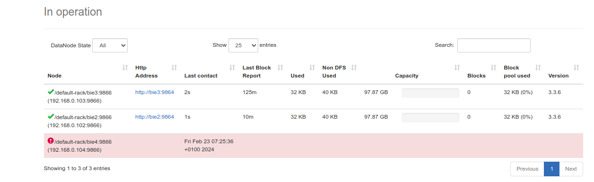

<!-- pagebreak -->

15.- Copia el archivo que has descargado previamente (hadoop-3.3.6.tar.gz) a HDFS con el siguiente comando: `hdfs dfs -copyFromLocal /home/hadoop/hadoop-3.3.6.tar.gz /`.</br>Captura la pantalla con el comando `ls` aplicado a hdfs para listar los documentos que están en la raíz de HDFS.

```bash
hdfs dfs -copyFromLocal /home/hadoop/hadoop-3.3.6.tar.gz /
hdfs dfs -ls -R / # verificamos
# -rw-r--r--   2 hadoop supergroup  730107476 2024-02-23 07:05 /hadoop-3.3.6.tar.gz
```

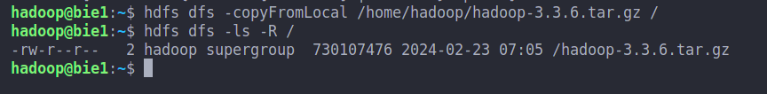

<!-- pagebreak -->

16.- Desde la interfaz web del namenode en el puerto 9870 averigua en qué nodos está replicado el archivo que has subido.</br> Realiza una captura donde se pueda ver esta información.

información común a todos los bloques

Block ID: 1073741836
Block Pool ID: BP-762343052-192.168.0.101-1708201041376

información por bloque

|block|nodo|Stamp|Size|
|-|-|-|-|
|block 0 | bie2 bie4 | 1010 |134217728 |
|block 1 | bie3 bie2 | 1010 |134217728 |
|block 2 | bie2 bie4 | 1009 |134217728 |
|block 3 | bie2 bie3 | 1010 |134217728 |
|block 4 | bie4 bie2 | 1011 |134217728 |
|block 5 | bie3 bie4 | 1012 | 59018836 |

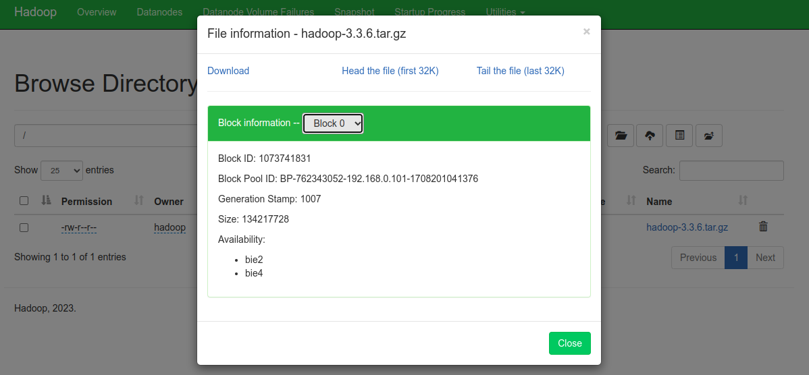

<!-- pagebreak -->

 Indica con tus palabras qué debería pasar si uno de los nodos que mantiene una réplica cae

> Si uno de los nodos se cae.
> esperamos 10 latidos por el valor de `dfs.heartbeat.interval` segundos
> esperamos dos periodos de gracia de `dfs.namenode.heartbeat.recheck-interval` mili-segundos
> si en ese tiempo el datanode no da señal  entra en modo dead.
> cuando entra en este modo , los bloques de este nodo se replican en otro nodo de manera temporal , para mantener siempre el numero de replicas de bloques `dfs.replication` una vez que se recupera el datanode, para mantener el numero de `dfs.replication` se eliminan las copias efectuadas en lo otros bloques de manera temporal.
