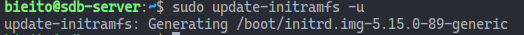

# Practica SBD01

## Objetivo

Esta actividad consiste en la creación de una máquina virtual Ubuntu Server y crear en esta máquina un RAID 5.

## Entorno

Los requisitos de la maquina virtual son:

- Ubuntu Server 22.04 LTS
- RAM: 2 gigabytessd
- Disco duro: 50 gigabytes
- Procesadores: 2
- Usuario: tu nombre
- Contraseña: abc123.
- 3 discos extra de 10 gigabytes
- 1 disco extra de 20 gigabytes

---

##### Conexion SSH

NEXT me gustaria evitar el acceso `modo puente`

```bash
# ubuntu desktop
ssh -p 22 bieito@192.168.0.24
User@ia23
# ubuntu server
ssh -p 22 bieito@192.168.0.16
abc123.
sudo systemctl restart net
```

### Documentacion

[Video Practica Raid 5](https://www.youtube.com/watch?v=sDG0o7T2KLg)

### Anotaciones

##### VBoxManage

- uso de virualbox desde consola

```bash
# Documentación => https://www.oracle.com/mx/technical-resources/articles/it-infrastructure/admin-manage-vbox-cli.html
# listar maquinas virtuales
VBoxManage list vms
# Ubuntu Desktop => "template_ubuntu_22.04_2RAM_40Disc" {85e8d5b1-db16-4a1b-a2b1-181a8c7a74b4}
# Ubuntu Server => "Template Ubuntu Server 22.04 LTS " {6bf743c7-f19e-4076-b6de-bf1ea121f5e1}
# ver la configuración actual
VBoxManage showvminfo {6bf743c7-f19e-4076-b6de-bf1ea121f5e1}
# máquinas virtuales que se están ejecutando en este momento
VBoxManage list runningvms
# encender maquina virtual
#ud
VBoxManage startvm {85e8d5b1-db16-4a1b-a2b1-181a8c7a74b4}
#us
VBoxManage startvm {6bf743c7-f19e-4076-b6de-bf1ea121f5e1}
# apagar maquina virtual
#ud
VBoxManage controlvm {85e8d5b1-db16-4a1b-a2b1-181a8c7a74b4} poweroff
#us
VBoxManage controlvm {6bf743c7-f19e-4076-b6de-bf1ea121f5e1} poweroff

```

#### Magnitudes

```bash
# Espacio en disco
df -h #`-h` formato humano
# Memoria
free -h #`-h` formato humano
```

##### Particiones principales de linux

- `sda1` alojar caragador de arranque ejemplo `grup`
- `sda2` almacenar el gestor del quernel que cargara el gestor de arranque (30 -100 Mb) recomendable mantener 2 o 3 versiones anteriores montada en (/boot/efi)
- `sda3` particion para el usuario montada en raiz (/)

##### Visualizar discos y particiones `lsblk`

- 'lsblk -e7'
  - `-e7` no ver las particiones loop

##### Crear una tabla de particiones `Fdisk`

- NEXT echar un ojo a diferencia entre tipos de tablas de particiones
- tabla de particiones MBR por defecto
- tabla de particion GPT
  - (+) cantidad y tamaño maximo de particiones
  - redundancia
  - id unico

##### Aplicar formato

- NEXT echar un ojo a los difrenetes tipos de formatos
- `mkfs.ext4`: Aplicar el Formato de archivos ext4.

##### Monitorizar

- `watch`
  - Este comando se utiliza para ejecutar cualquier comando arbitrario a intervalos regulares, mostrando el resultado de dicho comando en la ventana de la terminal
  - op [-n 1] ejecutar el comando cada segundo

##### Raid

- NEXT echar un ojo a los parametros al crear y al registrar un raid
- `mdadm`
- archivo de configuración : `/etc/mdadm/mdadm.conf`

##### Initramfs

- Muchos sistemas necesitan un sistema initramfs para arrancar correctamente
- Initramfs:

> initramfs `(Initial RAM File System)` es un sistema de archivos temporal utilizado durante el `proceso de arranque` de sistemas operativos basados en Linux.
> No es un tipo de dato en programación, sino una estructura de archivos comprimidos que se carga en la memoria RAM durante el inicio del sistema operativo.
> Su propósito principal es `proporcionar un entorno mínimo` necesario para `montar el sistema de archivos raíz` y permitir que el `kernel` continúe con el proceso de `arranque`.

##### Punto de montaje de unidades

- `mount`
- archivo de configuración : `/etc/fstab`

##### Basic

```bash
# https://www.dongee.com/tutoriales/comandos-basicos-de-linux/?utm_source=google&utm_medium=cpc&utm_campaign=tutoriales&utm_id=tutoriales&utm_term=comandos-linux&tm=tt&ap=gads&aaid=adaFnZvkSdpvp&gclid=CjwKCAiA98WrBhAYEiwA2WvhOr1Sluj4kYJF3nP_tWkLy7TrYogLFIot6qywMysy3NRfguIzonv9ihoC3G0QAvD_BwE
# directorios
mkdir
# crear un fichero y escribir en el cuando tenemos permisos de escritura con el usuario
cat source.txt > destination.txt
# crear un fichero y escribir en el cuando sin permisos de escritura con el usuario
echo "hola" | sudo tee p1.txt
# crear un fichero vacío
touch archivo.txt
#
ls -la
```

##### Red

```bash
sudo install net-tools # no es necesario solo para ejecutar `ifconfig`
# Ver IP
ip --brief addr show
ip a

```

##### Acceso ssh Host - Server

```bash
# Acceso mediante SSH
# nota [al instalar la imagen de ubuntu server inclumimos por defecto la instalacion de openssh server]
# Máquina configuramos el adaptador de red a modo puente.
# conexión server
ssh bieito@192.168.0.16
abc123.
# conexión u desktop
ssh bieito@192.168.0.24
User@ia23
# Ubuntu desktop
sudo apt-get install openssh-server
# manejar servicios
sudo systemctl enable ssh
# sudo systemctl disable ssh
sudo systemctl start ssh
# sudo systemctl stop ssh
# sudo systemctl restart ssh
# sudo systemctl status ssh
# sudo systemctl reload ssh
```


## Enunciado.

### 1.- Captura la salida del comando `lsblk`. Confirma que cumple con el enunciado y explica con tus palabras qué discos físicos (no particiones) tienes en el sistema.

`sda` Tenemos un disco inicial de 50G donde tenemos alojado el sistema.

`sbd , sdc , sdd` Tenemos 3 auxiliares de 10G

`sde` Tenemos un disco auxiliar de 20 g

```bash
sudo lsblk -e7
lsblk | grep -E 'sbd|sdc|sdd|sde'
```


### 2.- Prepara las particiones que necesitarás. Configúralas con la máxima capacidad posible teniendo en cuenta los discos con los que cuentas para realizar el RAID. Realiza la o las capturas necesarias (máximo 4 capturas) y justifica con tus palabras que las particiones están correctamente creadas para soportar el RAID 5 que vas a configurar.

Ejecutamos para los 4 discos el comando `fdisk` en los discos `dbb` `dbc` `dbd`

```bash
sudo fdisk /dev/sbd
sudo fdisk /dev/sdc
sudo fdisk /dev/sdd
# sudo fdisk /dev/sde
```

Dentro de `fdisk` ejecutamos el siguiente proceso

```bash
#en el menú de fdisk
#    op[g] cambiar el tipo de tabla de pàrticiones a GPT
#    op[n]
#    tipo de partición [p] primaria
#    número de partición [1]
#    sector inicial [por defecto] enter
#    sector final [por defecto] enter
#    op[w] escribir los cambios y salir
```

Verificar

```bash
sudo fdisk -l /dev/sbd
lsblk | grep -E 'sbd|sdc|sdd|sde'
```


### 3.- Crea un RAID 5 en la ruta /dev/md0 usando los 3 discos de 10 gigas como datos `y el disco de 20 gigas como repuesto`. Realiza una captura de pantalla del comando que usas. Explica con tus palabras cada parte del comando.

monitorizar el proceso

```bash
watch -n1 sudo mdadm --detail /dev/md0
```


crear Raid 5

```bash
sudo mdadm -C /dev/md0 -l raid5 -n 3 /dev/sbd1 /dev/sdc1 /dev/sdd1 --spare-devices=1 /dev/sde
```

- `mdadm` : utilidad Linux, utilizada para administrar RAID por Software
- `-C /dev/md0` : crea un raid en la ruta `/dev/md0`
- `-l raid5` : RAID 5
- `-n 3 /dev/sbd1 /dev/sdc1 /dev/sdd1` : usando los 3 discos de 10 gigas como datos -`--spare-devices=1 /dev/sde` : disco de 20 gigas como repuesto

Advertencia : nos comenta que ya existe una tabla de particiones en (/dev/sde)

```bash
mdadm: partition table exists on /dev/sde
mdadm: partition table exists on /dev/sde but will be lost or
       meaningless after creating array
mdadm: largest drive (/dev/sde) exceeds size (10475520K) by more than 1%
Continue creating array?
```

Confirmamos.


### 4.- Captura la pantalla del proceso que realizas para que esta configuración sea permanente y no desaparezca en el siguiente reinicio. Explica con tus palabras que pasos sigues.

- **Proceso crear un Raid permanente:**

1.  **Editamos `/etc/mdadm/mdadm.conf`:**

    ```bash
    sudo mdadm --detail --scan | grep md0 | sudo tee -a /etc/mdadm/mdadm.conf
    ```

    `sudo mdadm --detail --scan`: Este comando genera una salida que contiene información detallada sobre los conjuntos RAID configurados en el sistema.
    `grep md0`: Filtra las líneas que contienen la cadena "md0". Esto es útil si tienes varios conjuntos RAID y solo estás interesado en el conjunto md0.
    `sudo tee -a /etc/mdadm/mdadm.conf`: Utiliza tee para escribir la salida en el archivo /etc/mdadm/mdadm.conf. La opción -a se utiliza para agregar (append) la información al final del archivo sin sobrescribirlo.
    
    `📁 mdadm.conf`
    

2.  **Actualizar imagen del sistema:**
    actualiza la imagen inicial del sistema de archivos en la memoria RAM, asegurando que refleje los cambios recientes en la configuración del sistema antes de arrancar el sistema operativo.

    ```bash
    sudo update-inttramfs -u
    ```

        

### 5.- Formatea con ext4 la nueva partición de RAID5 y captura la terminal donde se vea el comando que usas. Explica con tus palabras brevemente cada parte del comando.

```bash
# mkfs make file sistem
sudo mkfs.ext4 /dev/md0
```

- `mkfs.ext4`: Aplicar el Formato de archivos ext4.

- `/dev/md0`: Especifica la ruta la cual quiero aplicarle ese formato

  

### 6.- Monta la partición RAID 5 en la ruta /mnt/raid y realiza una captura de pantalla donde se compruebe que está correctamente montada. Explica la captura de pantalla con tus palabras.

```bash
sudo mkdir /mnt/raid5
sudo mount /dev/md0 /mnt/raid5
```

adjunto captura donde se ve en la última columna la `ruta de montaje`
podemos comprobar que `sbd1 - sdc1 - sdd1 - sde` comparten un raid 5 `md0` montado en la ruta `/mnt/raid5`


### 7.- Captura la pantalla del proceso que realizas para que esta configuración sea permanente y siga montado en el siguiente reinicio. Explica con tus palabras que pasos sigues.

#### Actualizar el archivo `/etc/fstab`:

archivo de configuración en sistemas Linux que define cómo y dónde se deben montar los sistemas de archivos en el sistema

```bash
    echo "/dev/md0 /mnt/raid5 ext4 defaults,nofail,discard 0 0" | sudo tee -a /etc/fstab
```

#### Usando los siguientes parametros :

**dispositivo** → `/dev/md0` → Es el dispositivo del sistema de archivos
**punto de montaje** → `/mnt/raid5` → Es el directorio en el cual se montará el sistema de archivos.
**sistema de archivos** → `ext4` → Es el tipo de sistema de archivos.
**opciones**

- `defaults`: Son las opciones de montaje predeterminadas. -`nofail` : indica al sistema que no debe generar un error si el montaje del sistema de archivos no es exitoso -`discard` : Esta opción habilita la funcionalidad de TRIM para el sistema de archivos ext4. TRIM es una operación que le informa al dispositivo de almacenamiento que ciertos bloques de datos no se utilizan más, permitiendo que el dispositivo realice una limpieza anticipada y mejore el rendimiento a largo plazo,

**copia de seguridad** → `0` → Es el campo de opciones de copia de seguridad.
**arranque verificacion errores** → `0` → Es el campo de orden de verificación de errores al arrancar.


### 8.- Usa el comando mdadm --detail para mostrar el estado actual del RAID. Explica con tus palabras la información que consideres más relevante.


### 9.- Marca como fallo alguna partición del RAID y realiza la captura de pantalla del comando mdadm --detail de la partición del RAID en la que se vea que el disco de repuesto ha entrado en funcionamiento. En este apartado no hace falta justificar nada con texto, con la captura de pantalla es suficiente.

Eliminamos el disco `/dev/sdd1`

```bash
# eliminamos el disco /dev/sdd1 perteneciente al raid
sudo mdadm --manage /dev/md0 --remove /dev/sdd1
# ouput => mdadm: hot remove failed for /dev/sdd1: Device or resource busy
# lo intentamos nuevamente macando previamente la unidad como defectuosa
sudo mdadm --manage /dev/md0 --fail /dev/sdd1
# ouput => mdadm: set /dev/sdd1 faulty in /dev/md0
sudo mdadm --manage /dev/md0 --remove /dev/sdd1
# ouput => mdadm: hot removed /dev/sdd1 from /dev/md0
#  lsblk -e7 => sdd1 not type `raid5` not mount in `/mnt/raid5`
#   sdd                         8:48   0  10G  0 disk
#   └─sdd1                      8:49   0  10G  0 part
```

Bien aqui es donde la lio y hago y marco como defectuoso el dico sdc1
`sudo mdadm --manage /dev/md0 --fail /dev/sdc1`
lo soluciono :

```bash
# una vez que marco el disco como fail no tengo mas remedio que hacer el remove
sudo mdadm --manage /dev/md0 --remove /dev/sdc1
# la documentacion me dice que :
# tengo que Reensamblar el conjunto RAID, para ello tengo que detener el Raid , para lo cual tengo que desmontar la unidad
# primero desmonto `/dev/md0`
sudo sudo umount /mnt/raid5
# segundo detengo la ejecucion del el RAID
sudo mdadm --stop /dev/md0
# tercero intento Reensamblar indicando manualmente los discos
sudo mdadm --assemble /dev/md0 /dev/sbd1 /dev/sdc1 /dev/sde
# ouput => mdadm: /dev/md0 assembled from 1 drive and 1 spare - not enough to start the array.
# cuarto fuerzo Reensamblar indicando manualmente los discos
sudo mdadm --assemble --force /dev/md0 /dev/sbd1 /dev/sdc1 /dev/sde
# ouput
#   mdadm: forcing event count in /dev/sdc1(1) from 18 up to 1771
#   mdadm: clearing FAULTY flag for device 1 in /dev/md0 for /dev/sdc1
#   mdadm: Marking array /dev/md0 as 'clean'
#   mdadm: /dev/md0 has been started with 2 drives (out of 3) and 1 spare.
# quinto inicio el raid
sudo mdadm --run /dev/md0
# sexto monto `/dev/md0`
sudo mount /dev/md0 /mnt/raid5
# septimo por si acaso rescribo /etc/fstab (igual no era necesario puestoi que la ruta de montaje no cambio)
echo "/dev/md0 /mnt/raid5 ext4 defaults,nofail,discard 0 0" | sudo tee -a /etc/fstab
```

entiendo que como falta un disco el disco `sde` pasa automaticamente de `spare` a `active sync`

```bash
   Number   Major   Minor   RaidDevice State
       0       8       17        0      active sync   /dev/sbd1
       1       8       33        1      active sync   /dev/sdc1
       3       8       64        2      active sync   /dev/sde
```

Sustituimos el disco sdd1 por otro de 20G

```bash
# sin tabla de particiones
sdd                         8:48   0  20G  0 disk
# 1 hay que tener en cuenta que el disco debe ser exactamente igual vemos cuntos sectores tenia
sudo fdisk -l /dev/sbd1 | grep sectors
# ouput => Disk /dev/sbd1: 10 GiB, 10736352768 bytes, 20969439 sectors
# particionamos con fdisk = que antes,  pero añadimos en la opcion ultimo sector [+20969439]
sdd                         8:48   0  20G  0 disk
└─sdd1                      8:49   0  10G  0 part
# añadimos el disco
sudo mdadm --manage /dev/md0 --add /dev/sdd1
# ouput => mdadm: added /dev/sdd1
# problema al añadir el disco `sdd1` lo asigna como type `spare`
    Number   Major   Minor   RaidDevice State
       0       8       17        0      active sync   /dev/sbd1
       1       8       33        1      active sync   /dev/sdc1
       3       8       64        2      active sync   /dev/sde

       4       8       49        -      spare   /dev/sdd1
# solucion
sudo sudo umount /mnt/raid5
sudo mdadm --stop /dev/md0
sudo mdadm --assemble /dev/md0
sudo mdadm --manage /dev/md0 --fail /dev/sde
sudo mdadm --manage /dev/md0 --remove /dev/sde
sudo mdadm --manage /dev/md0 --add /dev/sde
sudo mount /dev/md0 /mnt/raid5
sudo mdadm --run /dev/md0
# ouput
    Number   Major   Minor   RaidDevice State
       0       8       17        0      active sync   /dev/sbd1
       1       8       33        1      active sync   /dev/sdc1
       4       8       49        2      active sync   /dev/sdd1

       3       8       64        -      spare   /dev/sde
```


### 10.- Realiza una captura de pantalla en la que se vea cuánto ocupa esta versión de Ubuntu Server en disco y también en memoria RAM. Compara el uso de disco y memoria en esta versión contra un Ubuntu Desktop y justifica con tus propias palabras qué sistema preferirías para montar en un clúster de ordenadores.


##### Disco

```bash
[Ubuntu Desktop]

[1] Espacio en Disco Usado
------

S.ficheros     Tamaño Usados  Disp Uso% Montado en
tmpfs            195M   1,6M  193M   1% /run
/dev/sda2         39G    16G   21G  44% /
tmpfs            972M      0  972M   0% /dev/shm
tmpfs            5,0M   4,0K  5,0M   1% /run/lock
/dev/sda1        511M   6,1M  505M   2% /boot/efi
tmpfs            195M   112K  195M   1% /run/user/1000

```

```bash
[Ubuntu Server]

[1] Espacio en Disco Usado
------

Filesystem                         Size  Used Avail Use% Mounted on
tmpfs                              197M  1,2M  196M   1% /run
/dev/mapper/ubuntu--vg-ubuntu--lv   24G  5,4G   17G  24% /
tmpfs                              982M     0  982M   0% /dev/shm
tmpfs                              5,0M     0  5,0M   0% /run/lock
/dev/sda2                          2,0G  130M  1,7G   8% /boot
tmpfs                              197M  4,0K  197M   1% /run/user/1000
/dev/md0                            20G   32K   19G   1% /mnt/raid5

```

En cuanto al disco hay una diferencia muy notable en el espacio destinado al usuario.
Pasa de usar 16G en la versión de escritorio de espacio para el usuario (`/dev/sda2`) a solamente 130M en la versión server.

##### Memoria

```bash

[Ubuntu Desktop]

[2] Memoria
------
               total       usado       libre  compartido   búf/caché   disponible
Mem:           1,9Gi       881Mi       105Mi       7,0Mi       956Mi       871Mi
Inter:         4,2Gi        66Mi       4,1Gi

```

```
[Ubuntu Server]

[2] Memoria
------

               total        used        free      shared  buff/cache   available
Mem:           1,9Gi       241Mi       1,1Gi       1,0Mi       584Mi       1,5Gi
Swap:          2,0Gi          0B       2,0Gi


```

En cuanto a recursos de memoria casi cuadriplica el valor usado en el escritorio frente a la del servidor.

Por lo tanto a nivel de recursos nos va a interesar el uso de la versión de servidor, para que los recursos de las máquinas se destinen lo máximo posible al objetivo que le queramos dar a el cluster. Y a su vez el mantenimiento y el acceso normalmente se realiza desde un terminal y no siendo necesario el uso de una interfaz gráfica.
